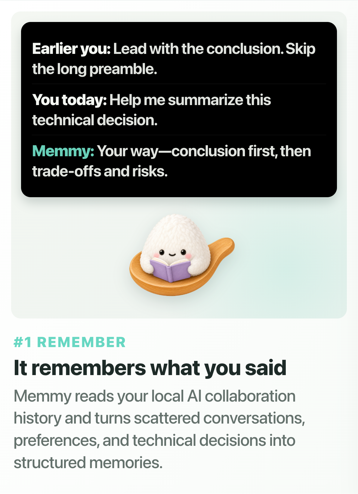
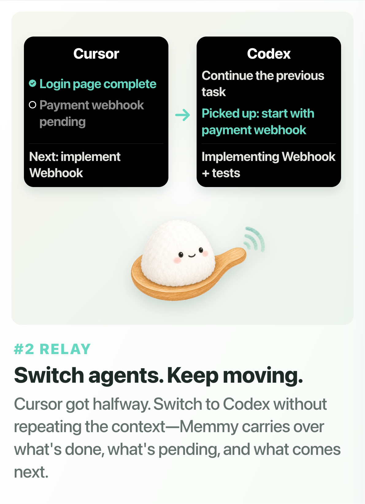
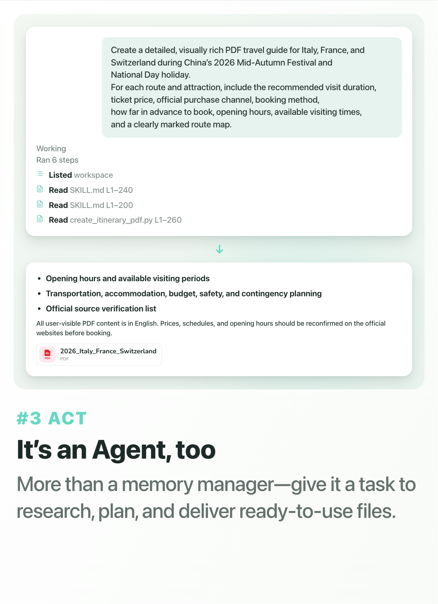
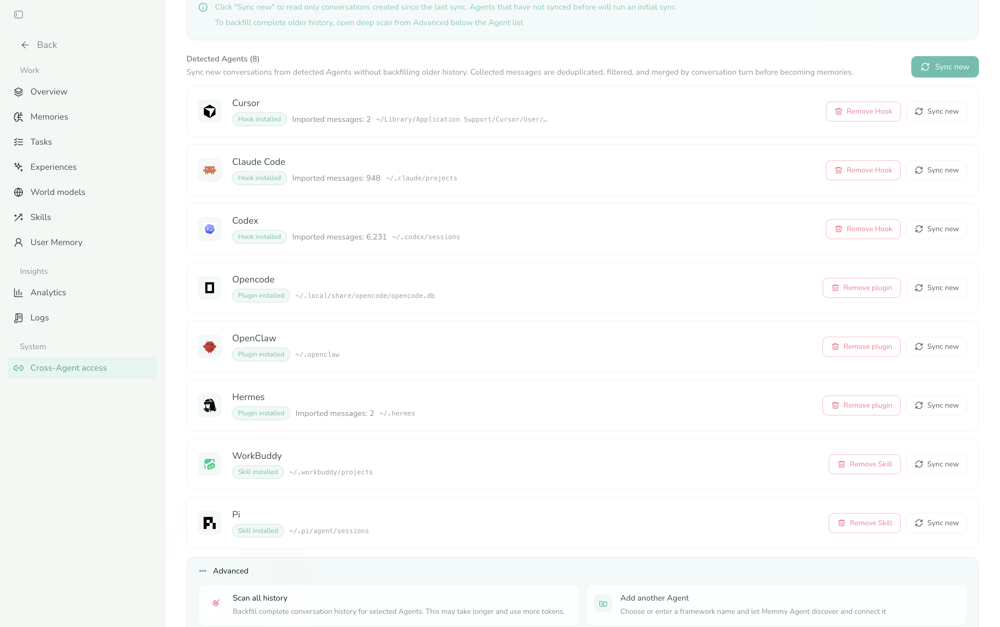
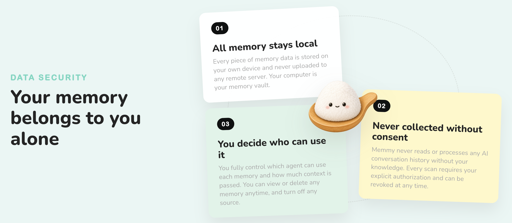
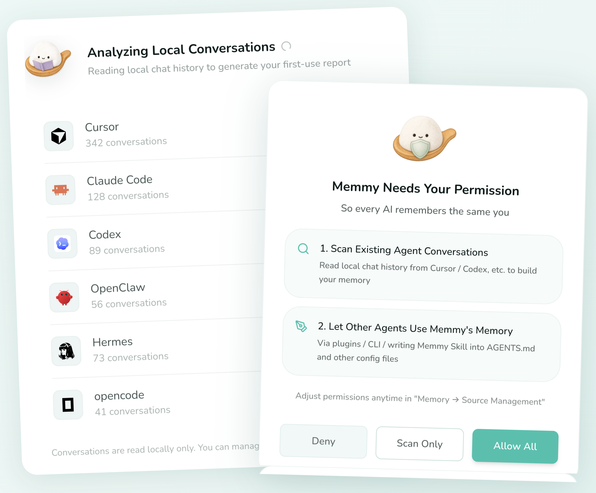
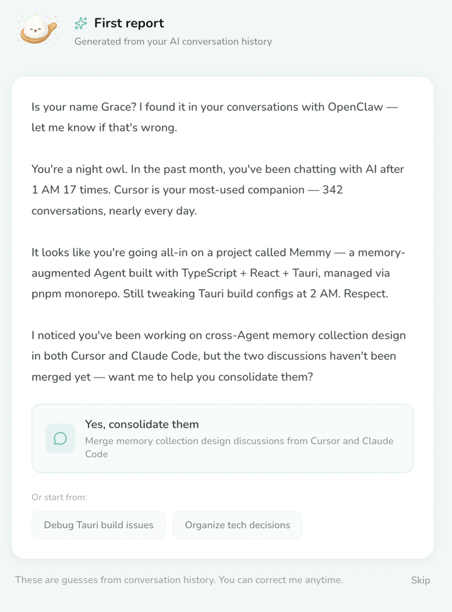

<br>
<div align="center">
  <a href="https://memmy.bot/">
    <picture>
      
    </picture>
  </a>
</div>
<br>
<br>
<p align="center">
    <a href="https://memmy.bot/docs/"></a>
    <a href="https://github.com/MemTensor/memmy-agent/releases"></a>
    <a href="https://discord.gg/zfhKKn52wP"></a>
    <a href="https://x.com/Memmy_ai"></a>
</p>
<p align="center">
    <a href="https://www.producthunt.com/products/memmy?embed=true&utm_source=badge-top-post-badge&utm_medium=badge&utm_campaign=badge-memmy-agent" target="_blank" rel="noopener noreferrer"></a>
</p>

<div align="center">
  
## Continue the same work across DeepSeek Harness, Claude Code, Codex, and etc.

[Overview](#what-is-memmy) · [Quick Start](#how-to-use-memmy) · [Technical Overview](#how-is-memmy-built) · [Roadmap](#roadmap) · [Acknowledgements](#acknowledgements) · [Contributors](#contributors)

</div>

<div align="center">

**English** • [简体中文](README.zh-CN.md)

</div>

<a id="what"></a>

## What Is Memmy?

<p align="center">
  
  
  
</p>

### Cross-Agent Task Continuity

<table align="center">
  <tr align="center" valign="middle">
    <td width="100%" valign="middle">
      <video src="https://github.com/user-attachments/assets/79318828-9b28-44a1-a940-c78dc2029dd3" width="100%" controls playsinline></video>
    </td>
  </tr>
</table>

### Most of the Agents You're Using Can Connect to Memmy

**DeepSeek Harness, OpenClaw, Hermes, Claude Code, Codex, Cursor, WorkBuddy, OpenCode, Pi...they all work!**



### Data Security



<a id="how"></a>

## How to Use Memmy

For complete installation and configuration instructions, see the [Getting Started guide](docs/en/start/getting-started.mdx).

#### 1. Desktop App (Recommended)

<p align="center">
  
  
</p>

Download Memmy from the [official website](https://memmy.bot/) or [GitHub Releases](https://github.com/MemTensor/memmy-agent/releases).

> [!TIP]
> Sign up for Memmy to receive free tokens and try the complete Memory + Agent Runtime.<br>
> **Trial credits:**<br>
> Registration grants Agent task trial tokens; the current balance and usage are shown in the app.<br>
> When the trial credits run out, switch to BYOK mode and use your own model API.

#### 2. Use the `memmy` CLI / TUI


On Linux x64 or arm64 with Node.js 22 or newer and an available systemd user session:

```bash
curl -fsSL https://raw.githubusercontent.com/MemTensor/memmy-agent/main/scripts/install.sh | bash
memmy
```

The installer enables the local Memory Service immediately as `memmy-memory.service`. The first bare `memmy` invocation opens the model setup wizard when needed, then enables `memmy-gateway.service`, waits for it to become ready, and enters the TUI. Both are `systemd --user` services bound to localhost and remain available after the TUI or terminal exits. They start again on later logins; the installer does not enable linger. Only the installer launcher activates this service management, so source-built Linux CLIs keep their existing behavior.

Before starting or reconnecting to the Gateway, `memmy` refreshes a private `~/.memmy/systemd/gateway.env` file (mode `0600`) with configuration-referenced environment variables, common Provider credentials, and the terminal `PATH`. If those values change, the next bare `memmy` invocation restarts the user service with the new environment.

```bash
systemctl --user status memmy-memory.service
systemctl --user status memmy-gateway.service
```

The installer initializes Memory without changing Codex, Claude Code, Cursor, or other agents. Run `memmy-memory init` (all detected agents) or `memmy-memory init --agent <agent>` when you explicitly want to install the Memory Skill and the supported Hook/plugin for an agent.

```bash
memmy onboard                              # Configure models, providers, gateway, memory, and tools interactively
memmy onboard --defaults                   # Initialize ~/.memmy/config.yaml and the workspace with defaults
memmy status                               # Check the configuration, model, and provider
memmy agent --message "Introduce the current workspace"  # Run a single-turn task
memmy                                      # Enter the interactive TUI
memmy serve                                # Start the OpenAI-compatible API (:18990)
```

The minimal BYOK configuration is located at `~/.memmy/config.yaml`:

```yaml
agents:
  defaults:
    model: openai/gpt-4.1
    provider: openai
    timezone: "+08:00"
providers:
  openai:
    apiKey: ${OPENAI_API_KEY}
```

#### 3. Use the `memmy-memory` CLI

Use it to access the local memory service from agents, scripts, and debugging workflows:

```bash
memmy-memory init
memmy-memory health
memmy-memory search "memory policies in this project"
memmy-memory add "a piece of knowledge worth saving"
memmy-memory get <id>
```

It connects to `http://127.0.0.1:18960` by default. Use `--url`, `--token`, `--config`, `--source`, and `--user-id` to specify the service and namespace.

#### 4. Start from the Source Code

```bash
git clone https://github.com/MemTensor/memmy-agent.git
cd memmy-agent
cp .env.example .env
npm install
npm run build
bash scripts/dev-start.sh
```

The script installs dependencies, builds the services, and starts the development environment. Node.js `>=22` and npm are required; use `Git Bash` on Windows.

<a id="architecture"></a>

## How Is Memmy Built?

For details about the architecture, memory service, and integration methods, see the [Memmy documentation](https://memmy.bot/docs/).

<p align="center">
  
</p>
<br>

## Roadmap

Memmy is building **personal memory infrastructure**, and its scope goes beyond coding Agents:

- **More memory sources** — expanding from AI conversations to browser activity, local documents, and eventually more devices and hardware.
- **Team collaboration** — planned Agent-to-Agent collaboration, letting team members' AI assistants share knowledge under privacy protection.
## Acknowledgements

This fork builds on [MemTensor/memmy-agent](https://github.com/MemTensor/memmy-agent), which in turn stands on the shoulders of:

- **[OpenClaw](https://github.com/openclaw/openclaw)** — open-source personal AI assistant pioneer; its multi-platform messaging exploration inspired Memmy's channel design.
- **[hermes-agent](https://github.com/NousResearch/hermes-agent)** — Nous Research's self-evolving agent; its persistent memory and skill self-learning practice showed what "gets better the more you use it" looks like.
- **[nanobot](https://github.com/HKUDS/nanobot)** — grew from a minimal prototype into a full-featured agent platform; its agent loop and MCP integration engineering informed Memmy's core design.

## Topic Inbox

Topic Inbox aggregates project L1 evidence memories into structured topics and
governed candidates (L2 / L3 / Skill). It runs as an asynchronous worker
pipeline and exposes REST endpoints for review and decision.

### Workflow

```text
L1 memory captured
       │
       ▼
embedding job (embedAfterCapture)
       │
       ▼
topic_ingest job  ◄── dedupeKey prevents duplicate runs
       │
       ▼
ProjectTopicInboxService.ingest(memoryId)
       │
       ├─ matchProjectTopic (cosine similarity)
       │
       ▼
analyzeProjectTopic
       │
       ├─ LLM: topic.inbox.analyze  ──► validateTopicAnalysis
       │                                       │
       │                              (fail)   ▼
       │                       topic.inbox.analyze.repair  (one retry)
       │
       ▼
evaluateTopicAutoApproval (policy: topic-auto-l2-v2)
       │
       ├─ approved  ──► candidate status = "approved", write L2 memory
       └─ rejected  ──► candidate status = "pending", await human review
```

### Trigger Points

`topic_ingest` jobs are enqueued from three places:

1. **Embedding completion** — after a new L1 memory is embedded
   (`embedding-job-processor.ts`).
2. **Quality update** — when `updateMemoryQuality` promotes an L1 memory
   (`memory-service.ts`).
3. **Reward pipeline** — after a reward episode is persisted
   (`reward-pipeline.ts`).

All three use `dedupeKey = "topic_ingest:<memoryId>:<contentHash>"` so the same
memory is not re-analyzed unless its content changes.

### LLM Operations

| Operation | Purpose |
|---|---|
| `topic.inbox.analyze` | Aggregate evidence into topic + candidates |
| `topic.inbox.analyze.repair` | Retry when `analyze` returns invalid JSON (schema mismatch, missing fields, bad enum) |

`repair` is triggered **only** when `validateTopicAnalysis` throws — i.e. the
LLM returned JSON missing `topic`/`candidates`, wrong field types, or invalid
enum values. It runs at most once per analysis; if repair also fails, the error
propagates and the job is retried by the worker.

### Auto-Approval Policy

Policy version: `topic-auto-l2-v2`

A candidate is auto-approved only when **all** conditions hold:

- `proposedLayer` is `"L2"`
- `risk` is `"low"`
- `confidence` is `"high"`
- `verificationStatus` is `"verified"`
- No conflicts or sensitive categories
- At least one cited evidence memory exists
- At least one cited evidence has a successful tool call or structured verification
- No evidence matches the `NEVER_AUTOMATIC` regex (security, credentials,
  destructive operations, migrations, schema changes)
- No evidence shows negated success patterns or failed tool calls
- Candidate title/conclusion do not match `NEVER_AUTOMATIC`

Candidates that fail any condition remain `pending` for human review via the
Topic Inbox UI or API.

### REST API

All routes require `panel-read` or `panel-write` capability and are scoped to
a namespace (`tenantId` + `projectId`).

| Method | Path | Capability | Description |
|---|---|---|---|
| `GET` | `/api/v1/topic-inbox` | `panel-read` | List topics with candidates and evidence counts |
| `POST` | `/api/v1/topic-inbox/refresh` | `panel-write` | Enqueue a full re-analysis of the namespace |
| `POST` | `/api/v1/topic-inbox/candidates/:id/decision` | `panel-write` | Approve, reject, defer, or edit-and-approve a candidate |
| `POST` | `/api/v1/topic-inbox/topics/:id/merge` | `panel-write` | Merge one topic into another |
| `POST` | `/api/v1/topic-inbox/topics/:id/split` | `panel-write` | Split evidence out of a topic into a new topic |
| `GET` | `/api/v1/topic-inbox/topics/:id/evidence` | `panel-read` | List raw evidence memories for a topic |

#### Request Examples

**List topics with pending candidates:**

```bash
curl -H "Authorization: Bearer $TOKEN" \
  "http://127.0.0.1:18960/api/v1/topic-inbox?namespace=$(jq -cn '{tenantId:\"default\",projectId:\"my-project\"}')&statuses=pending"
```

**Refresh topic analysis:**

```bash
curl -X POST -H "Authorization: Bearer $TOKEN" \
  -H "Content-Type: application/json" \
  -d '{"namespace":{"tenantId":"default","projectId":"my-project"}}' \
  "http://127.0.0.1:18960/api/v1/topic-inbox/refresh"
```

**Approve a candidate:**

```bash
curl -X POST -H "Authorization: Bearer $TOKEN" \
  -H "Content-Type: application/json" \
  -d '{
    "namespace": {"tenantId":"default","projectId":"my-project"},
    "decision": {"action":"approve","expectedVersion":1},
    "requestId": "idempotency-key"
  }' \
  "http://127.0.0.1:18960/api/v1/topic-inbox/candidates/cand_abc123/decision"
```

**Edit and approve:**

```bash
curl -X POST -H "Authorization: Bearer $TOKEN" \
  -H "Content-Type: application/json" \
  -d '{
    "namespace": {"tenantId":"default","projectId":"my-project"},
    "decision": {
      "action": "edit_and_approve",
      "expectedVersion": 1,
      "title": "Corrected title",
      "conclusion": "Refined conclusion",
      "proposedLayer": "L2"
    },
    "requestId": "idempotency-key"
  }' \
  "http://127.0.0.1:18960/api/v1/topic-inbox/candidates/cand_abc123/decision"
```

**Merge topics:**

```bash
curl -X POST -H "Authorization: Bearer $TOKEN" \
  -H "Content-Type: application/json" \
  -d '{
    "namespace": {"tenantId":"default","projectId":"my-project"},
    "targetTopicId": "topic_def456",
    "expectedVersion": 1,
    "targetExpectedVersion": 2,
    "requestId": "idempotency-key"
  }' \
  "http://127.0.0.1:18960/api/v1/topic-inbox/topics/topic_abc123/merge"
```

**Split topic:**

```bash
curl -X POST -H "Authorization: Bearer $TOKEN" \
  -H "Content-Type: application/json" \
  -d '{
    "namespace": {"tenantId":"default","projectId":"my-project"},
    "expectedVersion": 1,
    "title": "New split topic",
    "summary": "Evidence extracted from parent topic",
    "evidenceMemoryIds": ["mem_xyz789"],
    "requestId": "idempotency-key"
  }' \
  "http://127.0.0.1:18960/api/v1/topic-inbox/topics/topic_abc123/split"
```

#### Response Shapes

**List (`GET /api/v1/topic-inbox`):**

```json
{
  "projects": [{
    "namespace": {"tenantId":"default","projectId":"my-project"},
    "topics": [{
      "id": "topic_abc123",
      "title": "Topic title",
      "summary": "Topic summary",
      "version": 1,
      "candidates": [{
        "id": "cand_xyz",
        "status": "pending",
        "proposedLayer": "L2",
        "title": "Candidate title",
        "conclusion": "Candidate conclusion",
        "risk": "low",
        "confidence": "high",
        "verificationStatus": "verified"
      }],
      "evidenceCount": 5
    }]
  }],
  "serverTime": "2026-08-12T10:00:00.000Z"
}
```

**Decision (`POST .../decision`):**

```json
{
  "candidate": { "id": "cand_xyz", "status": "approved" },
  "memoryId": "mem_created_l2",
  "auditId": "audit_abc",
  "serverTime": "2026-08-12T10:00:00.000Z"
}
```

### Concurrency and Deduplication

- **`dedupeKey`** on `topic_ingest` jobs: `topic_ingest:<memoryId>:<contentHash>`.
  Same memory with unchanged content is skipped.
- **`claimAnalysisRun`** uses a lease mechanism to prevent concurrent analysis of
  the same topic.
- **`topic_refresh`** uses `namespaceId + evidenceCursor` as dedupe key.
- **Idempotent mutations**: all decision/merge/split routes accept a `requestId`
  and use `service.idempotent()` with `exactReplay: true` to guarantee
  at-most-once semantics.
- **Version conflicts**: mutations require `expectedVersion`; mismatched
  versions return HTTP 409 and the client should re-fetch.

### Configuration

Topic Inbox uses the same LLM client configured in `config.yaml`. No additional
configuration is required beyond enabling the Memory service.

```yaml
memmyMemory:
  version: 1
  activeProfile: byok
  storage:
    runtime: managed
    mode: local
    backend: sqlite
    sqlitePath: ~/.memmy/memory-service/memory.sqlite
  profiles:
    byok:
      embedding:
        provider: local
      # LLM used for topic.inbox.analyze and topic.inbox.analyze.repair
      completion:
        provider: openai
        model: gpt-4o-mini
```

The built-in viewer at `/viewer` includes a Topic Inbox panel for interactive
review, decision, merge, and split operations.
