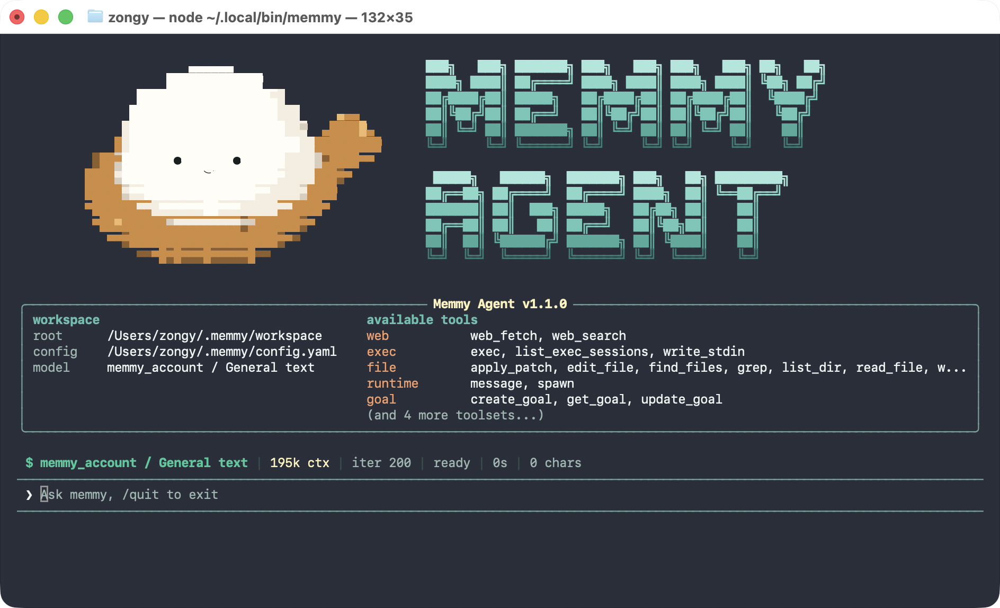
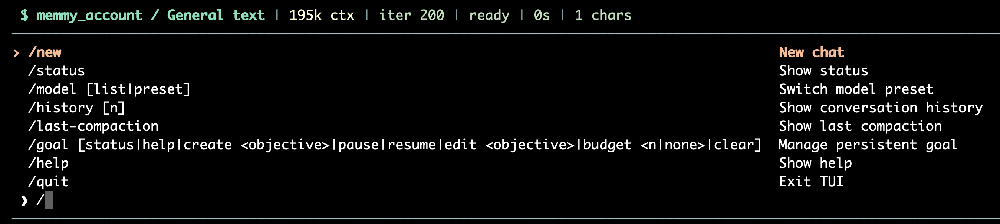

Memmy TUI 是 Memmy 的全屏终端界面。安装桌面端，或只安装 CLI，都可以在终端执行 `memmy` 使用它。



## 一、安装 Memmy TUI

### 方式一：安装 Memmy 桌面端

适用于 macOS 和 Windows。桌面端会提供 `memmy` 命令，并负责启动本地 Memory 和 Agent Gateway。

1. 从 [Memmy 官网](https://memmy.cn/) 或 [GitHub Releases](https://github.com/MemTensor/memmy-agent/releases) 下载并安装桌面端。

2. 启动 Memmy，完成账号模式或 API Key 模式配置。

3. 打开一个新的终端，检查命令是否可用：

```plaintext
memmy --help
memmy --version
```

- macOS 用户需要先把应用拖入 `/Applications`，并至少启动一次。若终端提示找不到 `memmy`，打开新终端或执行：

```plaintext
source ~/.zshrc
```

- Windows 用户安装完成后，请打开新的 PowerShell 或 Windows Terminal。

使用桌面端提供的 TUI 时，请保持 Memmy 桌面端运行。关闭桌面端后，它管理的 Gateway 也会停止。

### 方式二：只安装 Memmy CLI

适用于不需要桌面端的 Linux x64 或 arm64 环境。需要 Node.js `22` 或更高版本，并且系统支持 `systemd --user`。

```plaintext
curl -fsSL https://raw.githubusercontent.com/MemTensor/memmy-agent/main/scripts/install.sh | bash
```

安装完成后执行：

```plaintext
memmy
```

首次运行如果还没有可用模型，Memmy 会打开配置向导。CLI 安装器会管理 Memory 和 Gateway 服务；退出 TUI 或关闭终端后，服务仍会运行。

查看服务状态：

```plaintext
systemctl --user status memmy-memory.service
systemctl --user status memmy-gateway.service
```

## 二、首次配置

如果桌面端已经完成首次引导，可以跳过本节。CLI 用户建议执行：

```plaintext
memmy onboard --defaults
memmy onboard
memmy status
```

- `memmy onboard --defaults`：创建或刷新配置文件和 workspace，非交互式配置。

- `memmy onboard`：配置模型、Provider、Gateway、Memory 和工具，交互式配置。

- `memmy status`：检查当前配置、workspace、模型和 Provider。

默认位置：

- 配置文件：`~/.memmy/config.yaml`

- workspace：`~/.memmy/workspace`

## 三、打开 TUI

直接执行：

```plaintext
memmy
```

这会打开默认的 `cli:direct` 会话。输入消息后按 `Enter` 发送。

### 恢复或创建会话

```plaintext
# 恢复已有会话
memmy --session cli:work
# 创建新的独立会话
memmy --standalone
# 创建绑定到项目目录的会话
memmy --project /path/to/project
```

`--session`、`--standalone` 和 `--project` 只能选择一个。

查看已有会话：

```plaintext
memmy sessions list
```

### `memmy` 与 `memmy agent`

要打开本教程介绍的全屏 TUI，请使用裸 `memmy`。

`memmy agent` 适合单轮任务或传统终端交互：

```plaintext
# 单轮任务
memmy agent --message "介绍一下当前工作区"
# 从标准输入发送一轮任务
echo "总结这个项目" | memmy agent
```

## 四、发送任务

在 `❯` 后面输入内容，按 `Enter` 发送。TUI 当前没有桌面端工作台的 `Shift + Enter` 换行操作，`Enter` 始终表示提交。

长文本可以在终端中自动视觉换行，但不会插入多行内容。需要发送多行文本时，请使用：

```plaintext
memmy agent --message $'第一行\n第二行'
```

或：

```plaintext
printf '第一行\n第二行\n' | memmy agent
```

### 任务运行时继续输入

- `Enter`：排队发送下一轮任务。

- `Tab`：当当前回合由这个 TUI 执行时，把内容追加到当前回合。

如果当前回合来自桌面端或其他 IM 渠道，TUI 不会接管它；请使用 `Enter` 排队。

队列中有任务时，界面会显示排队数量、消息预览和消息来源。

## 五、键盘操作

基础操作在 macOS、Windows 和 Linux 上一致；行编辑组合键的主修饰键不同：

| **操作** | **macOS** | **Windows** | **Linux** |
| --- | --- | --- | --- |
| 发送；运行中排队下一轮 | `Enter` | `Enter` | `Enter` |
| 追加到当前由 TUI 执行的回合 | `Tab` | `Tab` | `Tab` |
| 移动一个字符 | `←` / `→` | `←` / `→` | `←` / `→` |
| 按单词移动 | `⌘ + ←` / `⌘ + →` | `Ctrl + ←` / `Ctrl + →` | `Ctrl + ←` / `Ctrl + →` |
| 移到输入开头 | `Home` 或 `Ctrl + A` | `Home` 或 `Ctrl + A` | `Home` 或 `Ctrl + A` |
| 移到输入末尾 | `End`、`Ctrl + E` 或 `⌘ + E` | `End` 或 `Ctrl + E` | `End` 或 `Ctrl + E` |
| 删除光标前内容至行首 | `Ctrl + U` 或 `⌘ + U`；`⌘ + Backspace` / `⌘ + Delete` | `Ctrl + U` | `Ctrl + U` |
| 删除光标后内容至行尾 | `Ctrl + K` 或 `⌘ + K` | `Ctrl + K` | `Ctrl + K` |
| 删除前一个单词 | `Ctrl + W` 或 `⌘ + W` | `Ctrl + W` / `Ctrl + Backspace` | `Ctrl + W` / `Ctrl + Backspace` |
| 删除字符 | `Backspace` / `Delete` | `Backspace` / `Delete` | `Backspace` / `Delete` |
| 停止自己执行的回合并退出 | `Ctrl + C` | `Ctrl + C` | `Ctrl + C` |

在 macOS 上，`⌘` 是 Command 键；Windows/Linux 使用 `Ctrl` 作为主要组合键。`Shift + Enter` 在所有平台上都不会插入换行，而是提交当前消息。

也可以输入以下任意命令退出：

```plaintext
exit
quit
/exit
/quit
:q
```

如果任务由其他渠道执行，`Ctrl + C` 只会退出当前 TUI，不会停止其他渠道的任务。

## 六、Slash 命令



TUI 支持 Slash 命令候选菜单。在输入区输入 `/` 即可打开菜单，继续输入命令名称（例如 `/go`）会筛选候选命令。输入空格进入参数或子命令后，候选菜单会关闭。

- `↑` / `↓`：切换候选命令。

- `Tab`：补全当前选中的命令入口，不会补全子命令或参数。

- `Enter`：如果当前输入是命令前缀，先确认补全；命令入口已经完整时执行命令。

- `Esc`：关闭候选菜单。

如果 `Enter` 只是完成了命令补全，再按一次 `Enter` 即可执行。

- 候选菜单显示当前可用的命令，以及该命令提供的参数或子命令提示。

- 参数和子命令不会分别生成候选项，例如 `/model list` 可以先补全 `/model`，再手动输入 `list`。

- `/stop` 只有在当前回合由该 TUI 执行时才显示。

- `/restart` 不显示，也不能在 TUI 中执行。

- `exit`、`quit`、`/exit`、`/quit`、`:q` 可以退出，但只有 `/quit` 出现在菜单中。

- `/history-dag` 是否出现取决于对应功能是否启用。

- 初始最多显示 8 个候选项，可继续输入命令前缀筛选其他命令。

| **命令** | **参数** | **作用** |
| --- | --- | --- |
| `/help` | 无 | 查看当前命令帮助 |
| `/status` | 无 | 查看运行状态、Provider 和渠道状态 |
| `/model` | 无 | 查看当前模型配置 |
| `/model list` | 无 | 列出模型预设 |
| `/model <preset>` | 模型预设名 | 切换模型预设，例如 `/model fast` |
| `/history` | 无 | 查看会话历史 |
| `/history <n>` | 消息数量 | 查看最近 `n` 条历史消息 |
| `/history-dag` | 无 | 查看会话历史 DAG |
| `/new` | 无 | 停止当前任务并开始新对话 |
| `/stop` | 无 | 停止当前由这个 TUI 执行的回合；不会停止其他渠道的任务 |
| `/restart` | 无 | TUI 不接受此控制命令；请退出后重启 Gateway |
| `/last-compaction` | 无 | 查看当前会话最近一次上下文压缩摘要 |
| `/quit` | 无 | 退出 TUI，不停止其他渠道正在执行的回合 |
| `/goal` | 无 | 查看当前持久目标 |
| `/goal status` | 无 | 查看持久目标状态 |
| `/goal help` | 无 | 查看 Goal 子命令帮助 |
| `/goal <objective>` | 目标内容 | 创建持久目标的简写形式 |
| `/goal create <objective>` | 目标内容 | 创建持久目标 |
| `/goal pause` | 无 | 暂停目标 |
| `/goal resume` | 无 | 恢复目标 |
| `/goal edit <objective>` | 新目标内容 | 修改目标 |
| `/goal budget <n\|none>` | 数字或 `none` | 设置或清除目标预算 |
| `/goal clear` | 无 | 清除目标 |
| `/pairing` | 无 | 查看或管理渠道配对 |
| `/pairing list` | 无 | 查看渠道配对请求 |
| `/pairing approve <code>` | 配对码 | 批准配对请求 |
| `/pairing deny <code>` | 配对码 | 拒绝配对请求 |
| `/pairing revoke <user_id>` | 用户 ID | 撤销用户配对 |

`/history-dag` 是否可用，取决于对应功能是否在配置中启用。

## 七、常见问题

### `memmy: command not found`

- macOS：确认 Memmy 已拖入 `/Applications` 并启动过一次，然后打开新终端或执行 `source ~/.zshrc`。

- Windows：打开新的 PowerShell 或 Windows Terminal。

- Linux：确认安装器执行成功，并检查 `~/.local/bin` 是否在 PATH 中。

### 没有可用模型

```plaintext
memmy onboard
memmy status
```

确认模型、Provider 和凭据已保存后，再执行 `memmy`。

### Gateway 不可用

- 使用桌面端：确认 Memmy 桌面端正在运行。

- 使用 Linux CLI：检查 `memmy-gateway.service`。

- 使用源码或手动运行的 CLI：在另一个终端执行 `memmy gateway`。

默认 Gateway WebSocket 端口是 `18980`。Linux 用户可以查看日志：

```plaintext
journalctl --user -u memmy-gateway.service
```

### 为什么 `memmy agent` 没有打开全屏界面

这是正常的。`memmy agent` 是单轮或传统终端入口；需要全屏 TUI 时执行：

```plaintext
memmy
```
